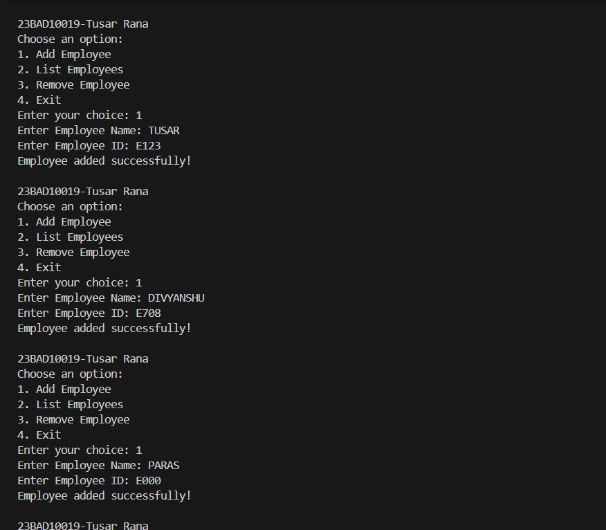
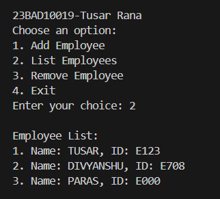
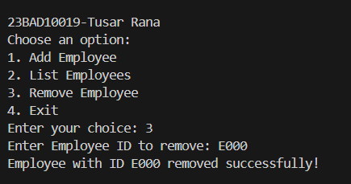
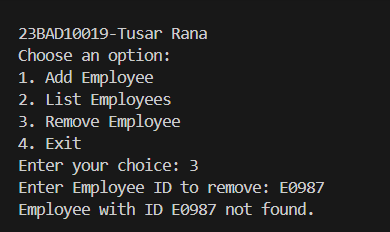
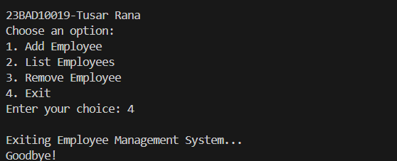

# Employee Management System (Node.js CLI)

This is a **Command-Line Interface (CLI) application** developed using **Node.js** that enables users to efficiently manage employee records.
It provides options to **add, display, and delete employee details** directly from the terminal.

---

## Project Layout

* **`employee.js`** → The main JavaScript file that contains the entire program logic.

---

## Key Features

1. **Add Employee** → Insert a new employee by entering their name and unique ID.
2. **View Employees** → Show a list of all stored employees with their details.
3. **Delete Employee** → Remove an employee from the system using their ID.
4. **Exit** → Safely close the application.

---

## How It Works

1. The program starts by displaying a **welcome message** and a **menu of actions**.
2. Users choose an option by typing the corresponding number.
3. Depending on the selection:

   * **1** → Input the employee’s name and ID to add them.
   * **2** → Display the complete employee list.
   * **3** → Remove a specific employee by their ID.
   * **4** → Exit the program.

---

## Code Overview

The script begins by importing **Node.js’s `readline` module**, which allows interactive input/output through the terminal.

* **Setting Up the Interface**

  * `readline.createInterface` establishes input/output streams for user interaction.

* **Data Handling**

  * An array named `employees` stores each employee record as an object containing:

    * `id` → The employee’s unique identifier.
    * `name` → The employee’s full name.

* **Menu Function**

  * The `showMenu()` function displays the available actions and processes the user’s selection.

* **Adding an Employee**

  * The `addEmployee()` function collects the employee’s name and ID from the user.
  * The new employee object is then pushed into the `employees` array.

* **Listing Employees**

  * The `listEmployees()` function checks whether any employees exist.
  * If present, it lists their names and IDs.
  * If the array is empty, a notification is shown.

* **Removing an Employee**

  * The `removeEmployee()` function requests the employee ID to delete.
  * It searches the `employees` array and removes the matching record if found.
  * If no match is located, an appropriate message is displayed.

* **Exiting the App**

  * Choosing option **4** prints a farewell message and ends the session using `rl.close()`.

* **Unique Tag**

  * The identifier **"23BAD10019-TUSAR RANA"** is displayed in the menu header for uniqueness.

---

## How to Run

1. Open a terminal window.
2. Navigate to the directory containing the project file.
3. Execute the program with:

```bash
node employee.js
```

---

## Sample Outputs

### Add an Employee



### View Employees



### Remove an Employee



### Invalid ID Entry



### Exit the Program



---

## Key Takeaways

* Learned how to build a **menu-driven CLI application** using Node.js.
* Gained experience with the **readline module** for terminal-based user interaction.
* Practiced **array manipulation** for adding, displaying, and deleting data.
* Strengthened understanding of **JavaScript functions, conditionals, and modular coding**.
* Worked with **in-memory data management** without relying on external databases.
* Developed the ability to design small yet practical applications for everyday use.
