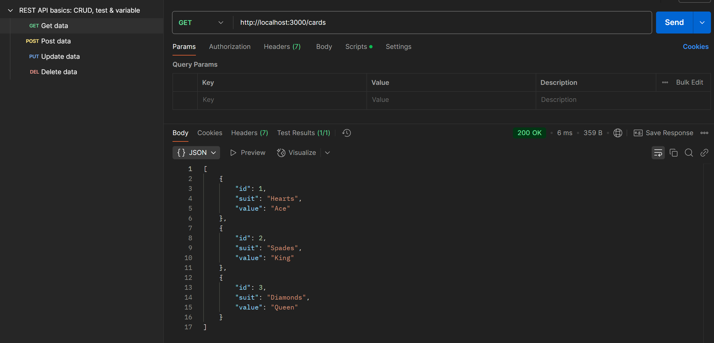
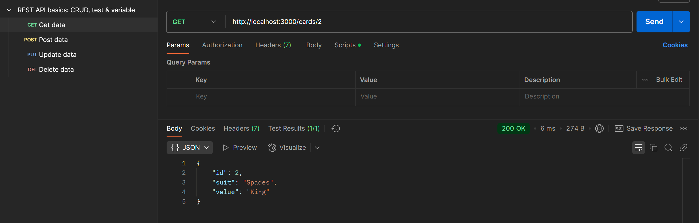
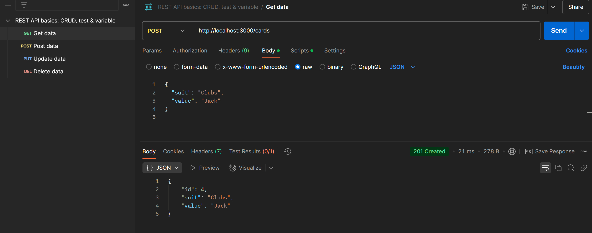
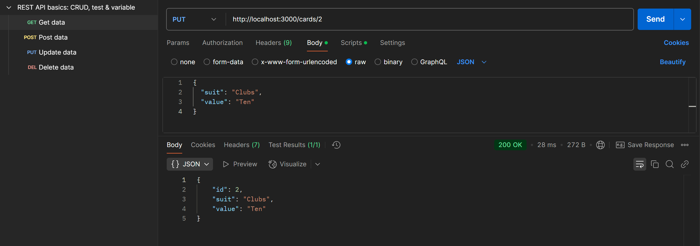
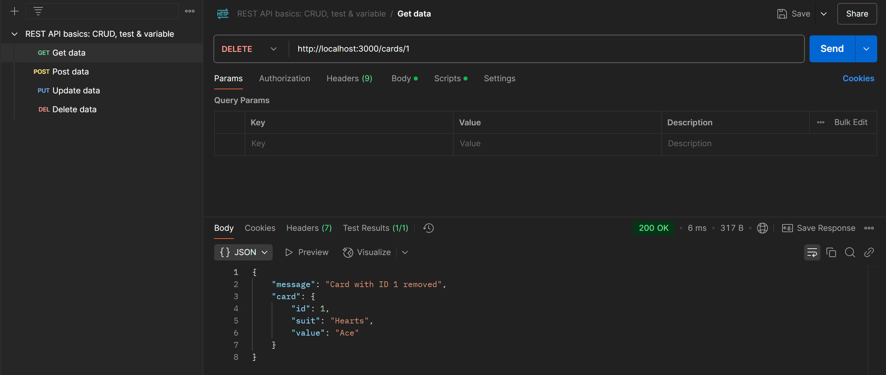
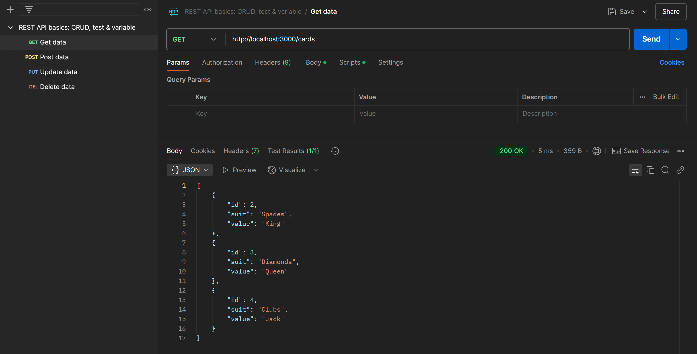

# REST API for Playing Card Collection Using Express.js

## Objective

Create a RESTful API with **Express.js** to manage a collection of playing cards.
This project showcases routing, HTTP method handling, and basic data manipulation within a Node.js backend.

---

## Project Structure

* **`server.js`** → The main file that contains all API functionality.

---

## Features

1. **Add Employee (POST)** → Insert a new employee with both `id` and `name`.
2. **Retrieve Employees (GET)** → Get a list of all employees in the system.
3. **Update Employee (PUT)** → Modify both the `id` and `name` of an existing employee.
4. **Partial Update (PATCH)** → Change only one field (`id` or `name`) at a time.
5. **Delete Employee (DELETE)** → Remove an employee by their ID.

---

## How It Works

1. **Initialize the Node.js project:**

```bash
npm init -y
```

2. **Install Express.js:**

```bash
npm install express
```

3. **Start the server:**

```bash
node server.js
```

4. **Server URL:**

```arduino
http://localhost:3000
```

---

## API Endpoints

| Method | Endpoint     | Description                                   | Request Body (JSON)                     | Example Response (JSON)                   |
| ------ | ------------ | --------------------------------------------- | --------------------------------------- | ----------------------------------------- |
| GET    | `/cards`     | Retrieve all cards in the collection          | None                                    | `[{"id":1,"suit":"Hearts","value":"A"}]`  |
| GET    | `/cards/:id` | Retrieve a specific card using its ID         | None                                    | `{"id":1,"suit":"Hearts","value":"A"}`    |
| POST   | `/cards`     | Add a new card to the collection              | `{ "suit": "Spades", "value": "K" }`    | `{"id":2,"suit":"Spades","value":"K"}`    |
| PUT    | `/cards/:id` | Replace the suit and value of a specific card | `{ "suit": "Diamonds", "value": "10" }` | `{"id":2,"suit":"Diamonds","value":"10"}` |
| DELETE | `/cards/:id` | Remove a card from the collection by its ID   | None                                    | `{"message":"Card deleted successfully"}` |

---

## Testing the API

The endpoints were verified using **Postman**.

---

## Sample Outputs

### GET All Cards



### GET a Card



### POST a Card



### PUT a Card



### DELETE a Card



### GET After Deletion



---

## Key Learnings

* Built a **REST API** using Express.js.
* Gained experience with HTTP methods: **GET, POST, PUT, PATCH, DELETE**.
* Practiced working with **request parameters** and **request bodies**.
* Learned how to handle errors for missing or incorrect employee IDs.
* Understood the structure of a CRUD-based API in Node.js.
* Improved skills in **API testing** with Postman.
* Strengthened knowledge of **modular backend coding practices**.
