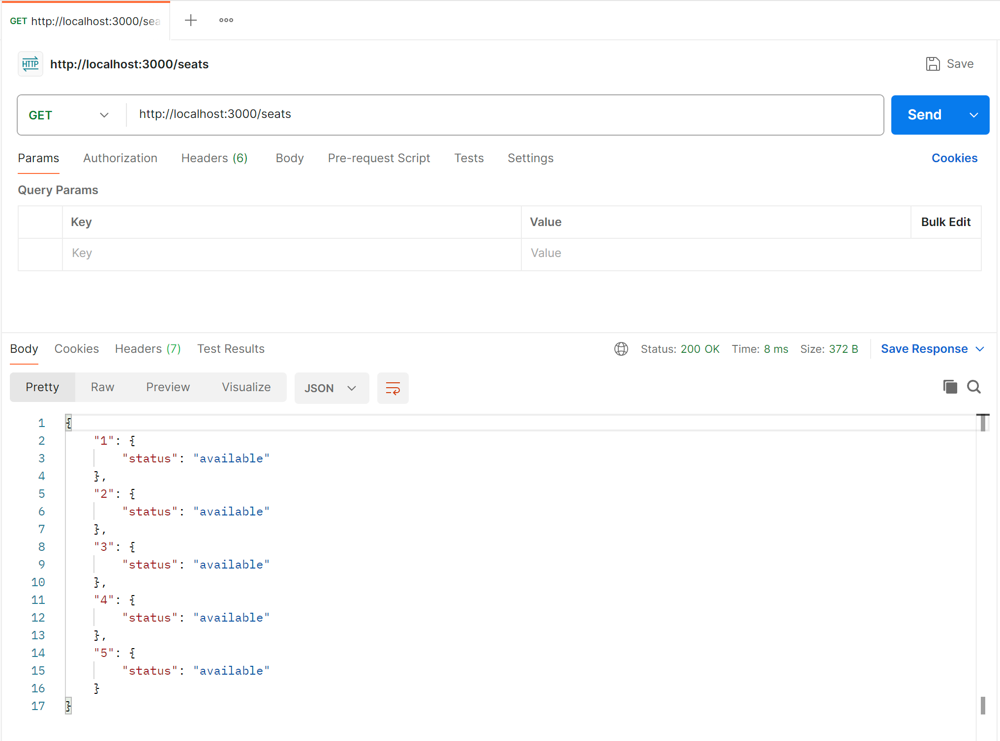
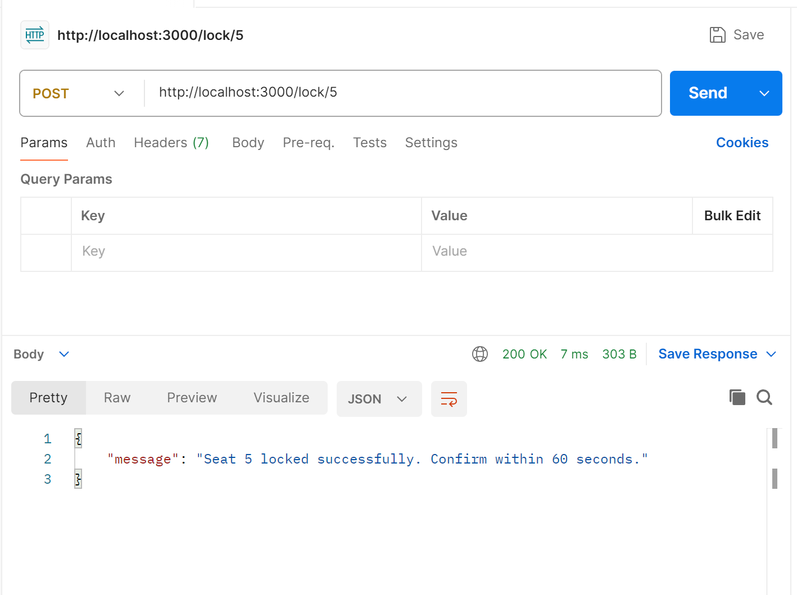
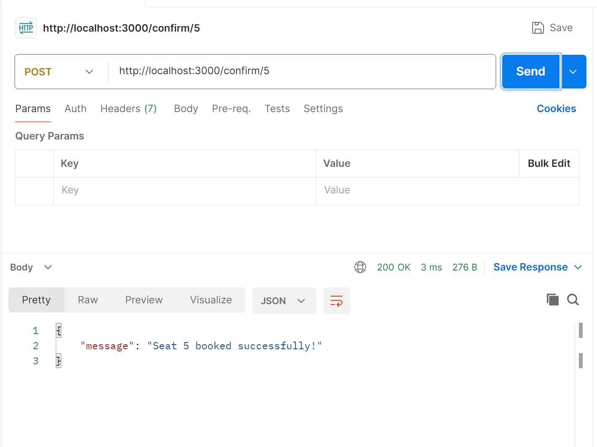
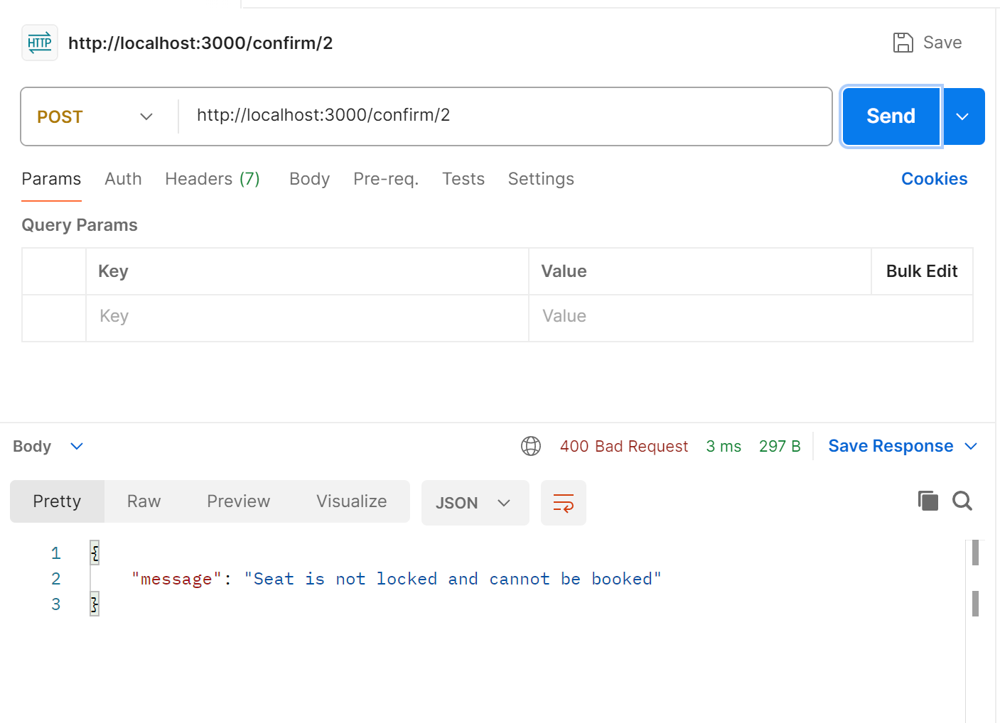
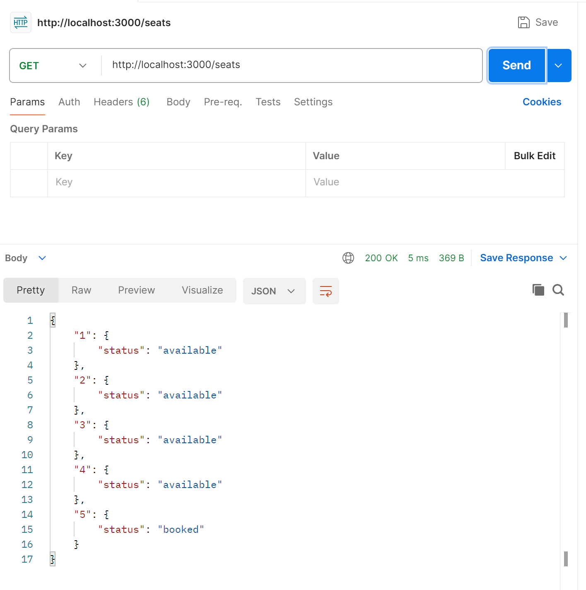
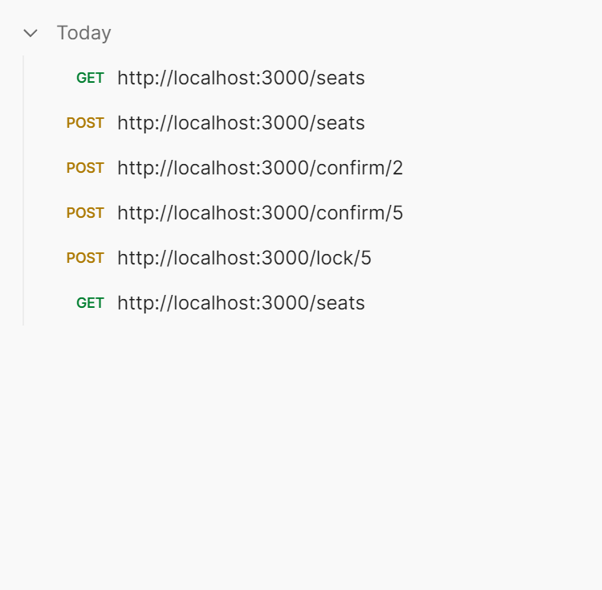

# Seat Booking System

This project demonstrates a basic **seat booking application** built with **Node.js and Express**.
It uses a **mutex-based locking mechanism** to safely handle seat reservations and ensure proper concurrency control.
Each lock expires automatically after a configurable period (default: **60 seconds**).

---

## Features

* Temporarily lock a seat before confirming the booking.
* Automatic release if a lock is not confirmed within the time limit.
* Prevents double booking with **individual seat locks**.
* API endpoints to **lock, confirm, release, and check the status** of seats.
* Simple custom mutex (`KeyedMutex`) to manage concurrent operations.

---

## Code Overview

1. **Seat Initialization**

   * At startup, the system creates 5 seats (IDs 1–5).
   * Each seat contains:

     * **status** → `available`, `locked`, or `booked`
     * **lockTimestamp** → the time the lock was applied
     * **lockTimerId** → the timer used to release the lock after 60 seconds

2. **KeyedMutex Class**

   * Acts like a traffic signal for each seat.
   * Ensures only one request (lock/confirm/release) for a particular seat is processed at any moment.
   * Prevents race conditions when multiple users try to book the same seat simultaneously.

3. **isLockExpired Function**

   * Checks whether a seat’s lock has exceeded the 60-second duration.
   * Automatically frees the seat if the lock has expired.

4. **`GET /seats` Endpoint**

   * Iterates over all seats.
   * Updates any expired locks to `available`.
   * Returns the current state of every seat.

5. **`POST /lock/:id` Endpoint**

   * Acquires the seat’s mutex to process one request at a time.
   * Returns an error if the seat is already booked.
   * If the seat was locked but the lock expired, it resets to `available`.
   * If free, it locks the seat and starts a 60-second countdown.
   * Once the timer ends (without confirmation), the seat is released automatically.

6. **`POST /confirm/:id` Endpoint**

   * Also uses the mutex for safe updates.
   * Returns an error if the seat isn’t locked.
   * If the lock has expired, it resets the seat and requests a new lock.
   * If still valid, it cancels the timer and marks the seat as permanently booked.

7. **`POST /release/:id` Endpoint**

   * Uses the mutex again to avoid conflicts.
   * If the seat is locked, it clears the timer and makes it available.
   * Returns an error if the seat wasn’t locked.

8. **app.listen**

   * Launches the Express server on port 3000.
   * Displays a console message confirming the system is running.

**In summary:**

* Each function handles a specific action such as checking, locking, unlocking, or booking seats.
* The **mutex** guarantees that two requests don’t update the same seat at the same instant.

---

## Installation

1. Install required dependencies:

```bash
npm install express
```

2. Start the server:

```bash
node server.js
```

3. Access the API at:

```bash
http://localhost:3000
```

---

## API Endpoints

1. **Check Seat Status**
   **GET /seats**
   Returns the current status of all seats.

   ```json
   {
     "1": { "status": "available" },
     "2": { "status": "booked" },
     "3": { "status": "locked" },
     "4": { "status": "available (lock expired)" },
     "5": { "status": "available" }
   }
   ```

2. **Lock a Seat**
   **POST /lock/\:id**
   Locks a seat for 60 seconds.

   ```json
   {
     "message": "Seat 1 locked successfully. Confirm within 60 seconds."
   }
   ```

3. **Confirm a Booking**
   **POST /confirm/\:id**
   Confirms the seat if it is locked and the lock has not expired.

   ```json
   {
     "message": "Seat 1 booked successfully!"
   }
   ```

4. **Release a Seat**
   **POST /release/\:id**
   Manually releases a locked seat.

   ```json
   {
     "message": "Seat 1 released"
   }
   ```

---

## Lock Expiration

* Each seat lock remains active for **60 seconds** (configurable via `LOCK_DURATION_MS`).
* If confirmation is not received in time, the seat automatically returns to `available`.

---

## Sample Outputs

### View All Seats



### Locking a Seat



### Confirming a Seat



### Confirm Attempt Without Locking



### Seat Status After Booking



### Postman Testing Steps



---

## Technology Stack

* **Node.js**
* **Express.js**
* **JavaScript (ES6)**

---

## Key Learnings

By implementing this project, I learned:

* Managing **in-memory data** for seat reservations.
* Using an asynchronous **Keyed Mutex** to handle concurrent requests in Node.js.
* Designing a **seat-locking mechanism** to prevent double bookings.
* Handling **lock expiration** and automatic release with timers.
* Building REST APIs with **Express.js** that return meaningful success and error messages.
* Simulating concurrency and testing endpoints using tools like **Postman**.
